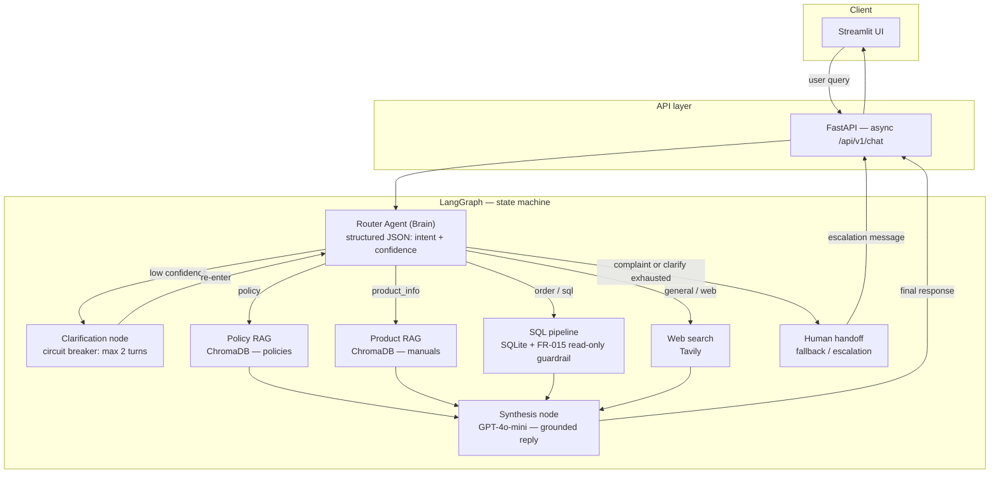

# Omni-Help — Enterprise Adaptive RAG Router

> An AI-powered customer support system that **classifies intent first**, then routes each query to the right data source — policy documents, order database, or live web search — before synthesizing a natural response.

**Live Demo:** [https://saving.fit](https://saving.fit) *(hosted on AWS EC2 with Nginx + Let's Encrypt SSL)*

---

## System Architecture

End-to-end flow: the **Streamlit** UI calls **FastAPI**; every request enters a **LangGraph** state machine where the **Router Agent** classifies the query *before* any tool runs. Conditional edges dispatch to **RAG** (ChromaDB), **SQL** (SQLite with FR-015), **Tavily**, or **clarification / human escalation**. Pipeline outputs converge on the **Synthesis** node, which returns a grounded answer to the client.



*GitHub renders Mermaid in Markdown. For local previews, use an editor or extension that supports Mermaid.*

### Key Design Decisions

| Decision | Rationale |
|---|---|
| **State-First strategy** | `AgentState` TypedDict is defined and validated before any pipeline is built. State is the only communication channel between nodes. |
| **Cyclic graph** | Supports self-correction. Clarification loops back to the Router with updated context instead of crashing or hallucinating. |
| **Structured Output (JSON mode)** | `RouterOutput(BaseModel)` enforced by OpenAI function-calling. The LLM cannot return a malformed classification. |
| **FR-015 SQL Guardrail** | Regex word-boundary check blocks `DROP`, `DELETE`, `UPDATE`, `INSERT`, `ALTER` before any query reaches SQLite. |
| **SQL query + rows in synthesis** | Synthesis LLM receives the SELECT clause alongside the result rows so it can map column names to anonymous tuple values. |
| **Module-level singletons** | LLM clients, DB connections, and ChromaDB handles are created once at import time — not per request. |

---

## Why This Matters

For **enterprise stakeholders** and **technical hiring teams**, this architecture is designed around control, safety, and measurable outcomes—not novelty for its own sake.

- **Zero-hallucination routing (state machine vs. pure ReAct)** — A dedicated **Router** node commits to a single intent *before* retrieval or tools run. Unlike an unconstrained ReAct loop—where the model can freely alternate between “think,” “act,” and “observe” and drift into the wrong tool—Omni-Help’s **explicit graph edges** make behavior **auditable and repeatable**. Recruiters see a **LangGraph** mental model; leaders see **predictable automation** with fewer surprise code paths.

- **Data security (FR-015 on SQL)** — Every generated SQL string passes a **read-only regex guardrail** that rejects `DROP`, `DELETE`, `UPDATE`, `INSERT`, `ALTER`, and related mutation patterns before execution. That **reduces blast radius** on proprietary order and customer data: the NL→SQL model cannot accidentally (or adversarially) instruct the runtime to destroy or modify production-shaped schemas.

- **Graceful degradation (web + clarification circuit breaker)** — **Tavily** failures are handled in layers (missing key, timeout, empty results) so the **graph never hard-crashes**. When the router is uncertain, a **clarification loop** (capped at two turns) gathers signal instead of guessing; when limits are hit, **human handoff** fires with structured context. Together, these patterns **cut false-confidence answers** and **lower unnecessary escalations**—support stays in the loop only when the system honestly signals ambiguity or complaint.

---

## Example Queries — Capabilities

Each row maps a **sample user question** to the **router intent** and the **pipeline** that serves it.

| Intent | Pipeline | Example query |
|--------|----------|---------------|
| **Policy (RAG)** | ChromaDB — `policies` | *"What is the restocking fee for returning electronics?"* |
| **Order status (SQL)** | SQLite + FR-015 | *"Where is my order ORD-1001?"* |
| **Product manual (RAG)** | ChromaDB — `products` | *"My EcoHome thermostat screen is blank, how do I fix it?"* |
| **External knowledge (Web)** | Tavily | *"What's the latest news on AI regulations?"* |
| **Escalation (human handoff)** | Fallback node | *"This is unacceptable, I demand to speak to a manager right now."* |

The **Streamlit** sidebar includes the same prompts for one-click copy/paste during demos.

---

## What Is Omni-Help?

Traditional RAG systems retrieve from a single source and hope for the best. Omni-Help takes a **Classification-First** approach:

1. **Router (The Brain):** A GPT-4o-mini classifier with structured JSON output reads the query and returns `intent`, `confidence`, and `reasoning` — before touching any data.
2. **Cyclic LangGraph:** A stateful, cyclic state machine routes to the right pipeline. If the router is under-confident, it cycles through a **Clarification Node** (up to 2 turns) before escalating to a human agent.
3. **Specialized pipelines:** Policy RAG and **product manual RAG** (ChromaDB), order **SQL** (SQLite/PostgreSQL) with read-only guardrails, and **Web Search** (Tavily).
4. **Synthesis Node:** A final LLM call converts raw pipeline output into a natural, grounded, conversational response.
5. **FastAPI + Streamlit:** A production-ready async API and a demo chat UI with per-message routing metadata.

---

## Features

- **100% router accuracy** on the 10-query Golden Dataset (validated with `tests/evaluation/eval_router.py`)
- **FR-015 read-only SQL guardrail** — mutation queries are blocked and surfaced as clean error messages
- **Graceful web failure** — 3-layer error handling (missing key → timeout → empty results), graph never crashes
- **Cyclic clarification loop** — max 2 turns with a circuit breaker that escalates to human fallback
- **Multi-turn conversation** — `conversation_id` threaded through LangGraph and Streamlit for session continuity
- **Per-request correlation IDs** — every API response carries a UUID for log tracing
- **Streamlit UI** — chat interface with routing metadata badge (`🗄️ Order DB · 99.0% confidence`)

---

## Project Structure

```
omnihelp/
├── src/
│   ├── agents/
│   │   └── router.py              # GPT-4o-mini classifier with structured output
│   ├── api/
│   │   ├── main.py                # FastAPI app — /health + /chat
│   │   └── schema.py              # Pydantic V2 request/response models
│   ├── config/
│   │   └── settings.py            # pydantic-settings enterprise config
│   ├── frontend/
│   │   └── app.py                 # Streamlit chat UI
│   ├── graph/
│   │   ├── graph.py               # Compiled cyclic StateGraph
│   │   ├── nodes.py               # All 7 node implementations
│   │   └── state.py               # AgentState TypedDict — source of truth
│   ├── prompts/
│   │   ├── router_prompts.py      # Intent classification system prompt
│   │   └── synthesis_prompts.py   # Context-grounded response prompt
│   ├── tools/
│   │   ├── sql_db.py              # Secure SQLite tool + FR-015 guardrail
│   │   ├── vector_store.py        # ChromaDB retriever wrapper
│   │   └── web_search.py          # Tavily search wrapper + graceful failure
│   └── utils/
│       ├── init_db.py             # SQLite schema + dummy data seeding
│       └── ingest.py              # Document ingestion → ChromaDB
├── data/
│   ├── policies/                  # Source markdown policy documents
│   ├── manuals/                   # Product manuals for product RAG
│   ├── db/                        # SQLite database (runtime, gitignored)
│   └── vectors/                   # ChromaDB persisted embeddings (runtime, gitignored)
├── tests/
│   ├── evaluation/
│   │   ├── golden_dataset.json    # 10-query baseline (2 per intent)
│   │   └── eval_router.py         # Router accuracy harness
│   ├── test_cycle.py              # Cyclic graph integration tests (mocked)
│   └── test_nodes.py              # Unit tests for all 5 live nodes (mocked)
├── docs/
│   └── learning/
│       └── 01_Router_and_State_Machine.md
├── .env.example                   # Environment variable template
├── pyproject.toml                 # Dependencies + tool config
└── README.md
```

---

## Quickstart

### Prerequisites

- Python 3.11 (required — Python 3.14 breaks ChromaDB's Pydantic V1 dependency)
- OpenAI API key
- Tavily API key (for web search)

### 1. Clone and set up the environment

```bash
git clone https://github.com/jshahid21/omnihelp.git
cd omnihelp

python3.11 -m venv .venv
source .venv/bin/activate

pip install -e ".[dev]"
```

### 2. Configure environment variables

```bash
cp .env.example .env
```

Open `.env` and fill in at minimum:

```bash
OPENAI_API_KEY=sk-...
TAVILY_API_KEY=tvly-...
```

To enable LangSmith tracing:

```bash
LANGCHAIN_TRACING_V2=true
LANGCHAIN_API_KEY=ls__...
LANGCHAIN_PROJECT=omni-help
```

### 3. Seed the databases (run once)

```bash
# Initialize SQLite orders database
python src/utils/init_db.py

# Ingest policy + product manuals into ChromaDB (two collections)
python src/utils/ingest.py
```

You should see separate counts for the `policies` and `products` collections printed at the end.

### 4. Start the FastAPI backend

```bash
uvicorn api.main:app --host 0.0.0.0 --port 8000 --reload --app-dir src
```

Verify with: `curl http://localhost:8000/api/v1/health`

### 5. Start the Streamlit frontend

In a second terminal:

```bash
source .venv/bin/activate
streamlit run src/frontend/app.py
```

Opens at **http://localhost:8501**

---

## Testing

### Run the offline unit test suite (no API keys required)

```bash
pytest tests/test_nodes.py tests/test_cycle.py -v
```

All external calls (OpenAI, ChromaDB, SQLite, Tavily) are mocked. The full suite completes in under a second.

### Run the live router evaluation (requires `OPENAI_API_KEY`)

```bash
python tests/evaluation/eval_router.py
```

Expected output:
```
✅ [g1]  Expected: policy       Got: policy       Conf: 0.97
...
Accuracy: 10/10  (100.0%)
✅ TARGET MET
```

### Test individual pipelines via the API

```bash
# Policy pipeline
curl -s -X POST http://localhost:8000/api/v1/chat \
  -H "Content-Type: application/json" \
  -d '{"query": "What is the electronics return policy?"}' | python3 -m json.tool

# SQL pipeline
curl -s -X POST http://localhost:8000/api/v1/chat \
  -H "Content-Type: application/json" \
  -d '{"query": "Where is my order ORD-1001?"}' | python3 -m json.tool

# Fallback (complaint)
curl -s -X POST http://localhost:8000/api/v1/chat \
  -H "Content-Type: application/json" \
  -d '{"query": "This is unacceptable. I want a manager NOW."}' | python3 -m json.tool
```

---

## API Reference

### `GET /api/v1/health`

```json
{"status": "healthy", "version": "1.0.0"}
```

### `POST /api/v1/chat`

**Request:**
```json
{
  "query": "Where is my order ORD-1001?",
  "conversation_id": "optional-session-uuid"
}
```

**Response:**
```json
{
  "response": "Your order ORD-1001 is currently Shipped via UPS...",
  "intent": "sql",
  "confidence": 0.99,
  "correlation_id": "3f7a2c1e-4b5d-..."
}
```

Interactive docs: **http://localhost:8000/docs**

---

## Stack

| Layer | Technology |
|---|---|
| Orchestration | [LangGraph](https://github.com/langchain-ai/langgraph) — cyclic stateful agent graph |
| LLM | OpenAI GPT-4o-mini via `langchain-openai` |
| Vector Store | ChromaDB (dev) / Qdrant (prod) |
| SQL | SQLite (dev) / PostgreSQL (prod) via LangChain SQLDatabase |
| Web Search | [Tavily](https://tavily.com) |
| Backend | FastAPI + Uvicorn (async) |
| Frontend | Streamlit |
| Config | pydantic-settings |
| Observability | LangSmith |
| Testing | pytest + unittest.mock |

---

## License

MIT
